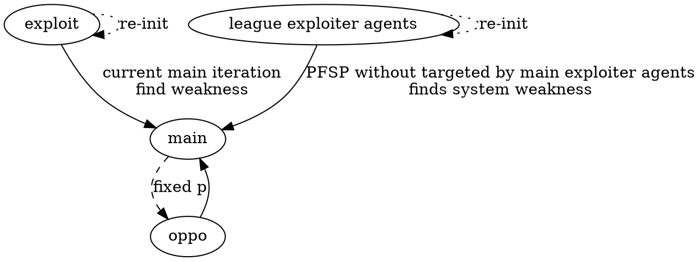

# AlpahStar

## Challenges

- vast space of cyclic, non-transitive strategies and counter-strategies
- self-play hard to get novel strategies
- strategies not effective in real world play
- large action space(1e3)
- imperfect information

## Human Data

Hardly explore useful tactics with naive exploration. Good actions are really sparse.

- supervized learning
- human statistic $$z$$, reward agents which follows human strategy, or punish actions disobeying supervizing policies.

## ENV

- 1e4 steps
- 10-min episode

### OBS

- a list of observable items and its attrs

### Act

- 1e3 choices
- structured
    - **action** type(1e2): move, build a worker
    - **object**: who to issue that action to, for any subset of the agent's units
    - **spacial**: where to target, among locations on the map or units within the camera view
    - **time**: when the next action will be issued
- **move camera view**
- 1e26 combinations

### States

- $$o_{1: t}$$
- $$a_{1: t-1}$$

### Monitor layer

- network latency and computation time
- APM limits

## Policy

$$\pi_\theta(a_t|s_t,z)$$

map(s, z) -> a

### Agents

- Algorithm: 
  1. policy gradient similar to advantage actor-critic
  2. asynchronously on repalyed experiences
  3. off-policy
- temporal difference learning(TD($$\lambda$$))
- clipped importance sampling(V-trace)
- self-imitation algorithm(UPGO)
- value function share weights: estimated using both player's and opponents's perspectives

### League training

Priortized Fictitious self-play(PFSP)

- **main agent**: priortized fictitious self-play, be selected as an opponent
- **main exploiter agents**: play with only current iteration of **main agent**

### Model

- **self-attention** of obs
- **scatter connections**: to integrate spatial and non-spatial features
- **LSTM**: partial obs
- **auto-regressive policy and recurrent pointer network**: structured combinatorial action space
